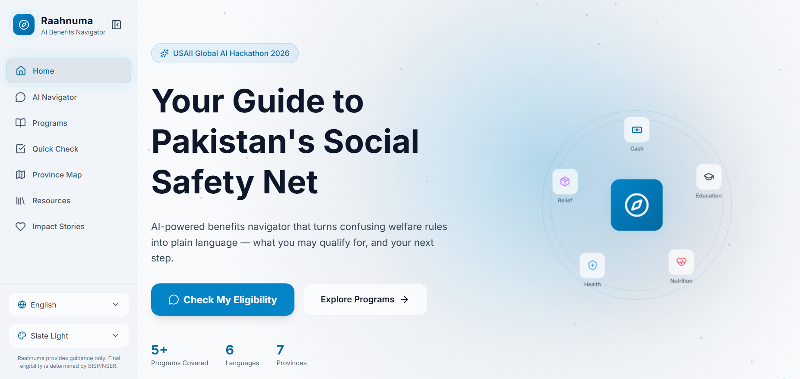
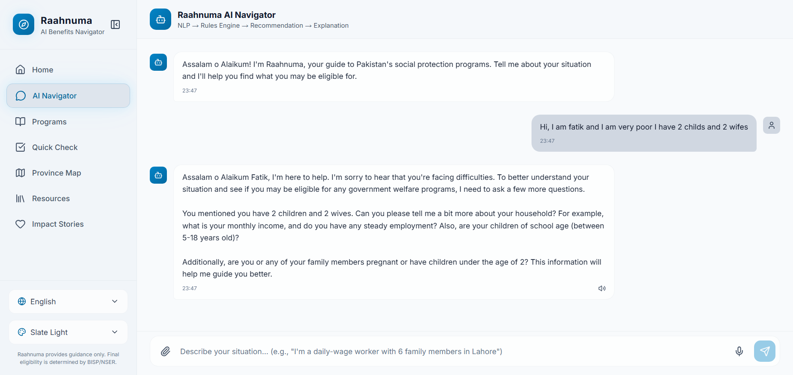
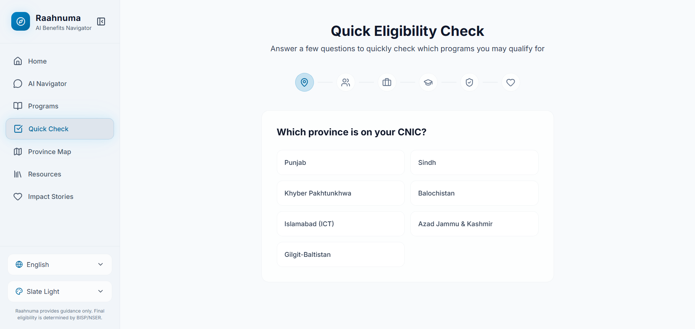
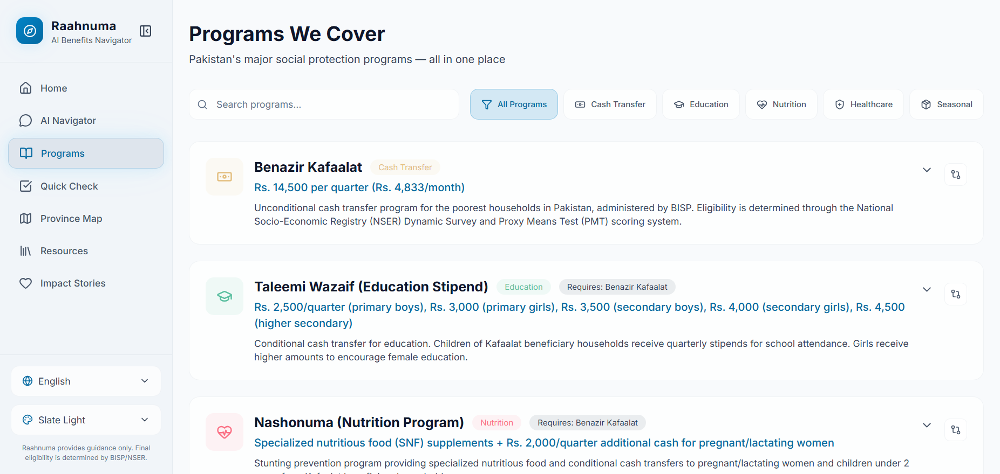
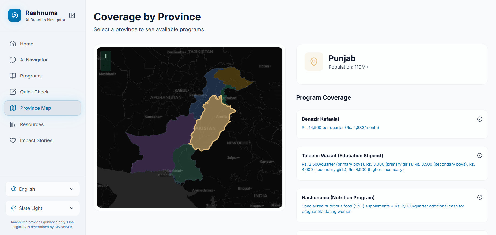
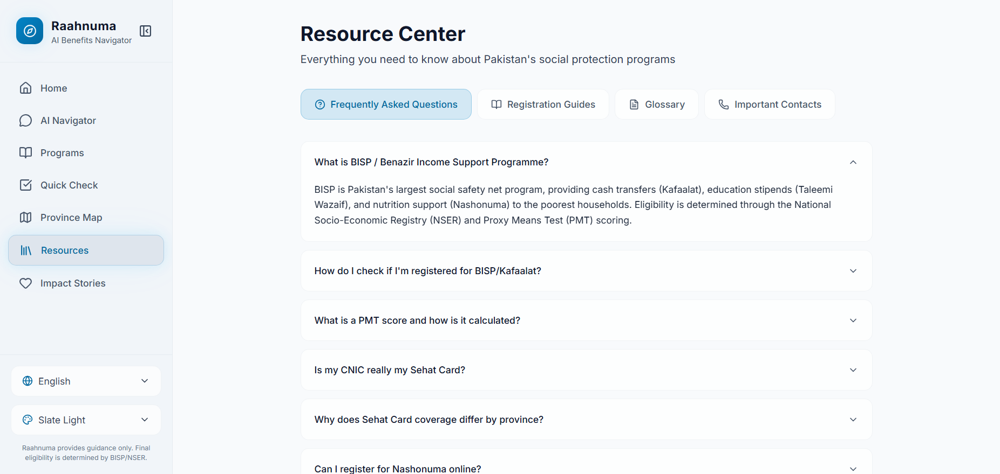
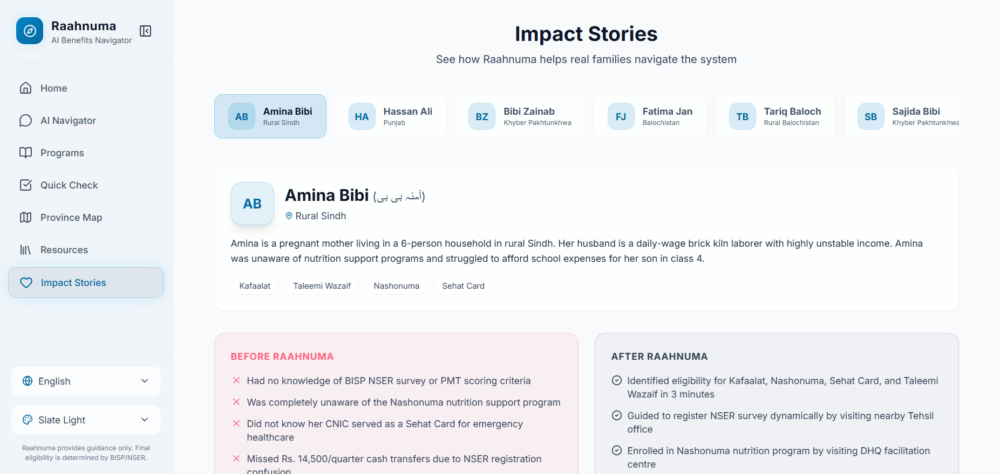

# Raahnuma — رہنما

### AI Benefits Navigator for Pakistan's Social Protection System

> **USAII Global AI Hackathon 2026** | Undergraduate Track | Challenge Brief 4A: Benefits Navigator

Raahnuma (Urdu: رہنما — "guide") helps Pakistani citizens understand which government welfare programs they **may** be eligible for — in plain language, in their own language, with clear next steps.

**Team:** Muhammad Fatik · Kaleem · Imaad Fazal

---

## Screenshots

> Add your screenshots to `public/screenshots/` with these filenames after taking them.

| Page              | Screenshot                                        |
| ----------------- | ------------------------------------------------- |
| Landing Page      |    |
| AI Navigator      |  |
| Quick Checker     |   |
| Programs Explorer |       |
| Province Map      |        |
| Resource Center   |     |
| Impact Stories    |         |

---

## Problem

Over 9 million families receive BISP cash transfers, but millions more qualify and don't know it. Eligibility rules are buried in bureaucratic language, spread across multiple agencies, and change by province. People miss out on support not because they don't want it, but because **the system is too confusing to navigate.**

## Solution

Raahnuma uses a **hybrid AI architecture** — LLM for understanding human situations, deterministic rules engine for eligibility — so users get accurate, explainable results without AI hallucinating program thresholds.

```
User Input → NLP (Groq) → Need Classification → Rules Engine → Recommendation → Explanation
```

## Features

| Feature                           | Description                                                               |
| --------------------------------- | ------------------------------------------------------------------------- |
| **AI Chat Navigator**       | Describe your situation in plain language; get program-by-program results |
| **Hybrid Architecture**     | Rules engine for thresholds + LLM for situation parsing                   |
| **6 Languages**             | English, Urdu, Sindhi, Pashto, Punjabi, Balochi (RTL support)             |
| **Voice Input**             | Web Speech API with waveform animation                                    |
| **Voice Output**            | ElevenLabs TTS with browser fallback                                      |
| **Document OCR**            | Upload CNIC/B-Form — Gemini Vision extracts details                      |
| **5 Programs**              | Kafaalat, Taleemi Wazaif, Nashonuma, Sehat Card, Ramzan Relief            |
| **Province-Aware**          | Sehat Card coverage varies by CNIC province                               |
| **Cross-Program Detection** | "Qualifying for X may also unlock Y"                                      |
| **Quick Checker**           | 6-step wizard for non-chat eligibility check                              |
| **Programs Compare**        | Side-by-side comparison of up to 3 programs                               |
| **Province Map**            | Interactive coverage by province                                          |
| **Resource Center**         | FAQs, registration guides, SMS templates, glossary                        |
| **Impact Stories**          | Before/after persona walkthroughs                                         |
| **SMS Generator**           | Pre-filled 8171/8500 SMS from CNIC                                        |
| **Share & Print**           | WhatsApp share, clipboard copy, print report                              |
| **Nearby Offices**          | BISP, NADRA, DHQ hospital locations by province                           |
| **Responsible AI**          | "May qualify" framing — never "you qualify"                              |

## Tech Stack

| Layer        | Technology                                        |
| ------------ | ------------------------------------------------- |
| Frontend     | Next.js 16, React 19, TypeScript, Tailwind CSS v4 |
| AI / NLP     | Groq (`llama-3.3-70b-versatile`)                |
| Vision / OCR | Google Gemini 2.0 Flash                           |
| Voice TTS    | ElevenLabs (optional) + Web Speech API fallback   |
| Rules Engine | Deterministic TypeScript evaluator                |
| Validation   | Zod schemas on all API routes                     |
| Deploy       | **Vercel** (recommended)                    |

## Quick Start

```bash
git clone https://github.com/Fastian-afk/Raahnuma.git
cd Raahnuma
npm install
cp .env.example .env.local
# Add API keys — see API_SETUP_GUIDE.md
npm run dev
```

Open http://localhost:3000

## API Setup & Deployment

**See [API_SETUP_GUIDE.md](./API_SETUP_GUIDE.md)** for step-by-step instructions to:

1. Create Groq, Gemini, and ElevenLabs API keys
2. Deploy to Vercel (recommended), Railway, or Render
3. Optional: database and rate-limiting for production

## Project Structure

```
src/
├── app/
│   ├── page.tsx              # Landing page
│   ├── navigator/            # AI Chat interface
│   ├── programs/             # Programs explorer + compare
│   ├── checker/              # Quick eligibility wizard
│   ├── map/                  # Province coverage map
│   ├── resources/            # FAQs, guides, glossary
│   ├── stories/              # Impact stories
│   └── api/
│       ├── chat/             # Groq NLP + rules engine
│       ├── ocr/              # Gemini document extraction
│       └── tts/              # ElevenLabs voice output
├── components/
│   ├── layout/               # AppShell, navigation
│   └── results/              # ResultCard, ResultsPanel, SMS, Offices
└── lib/
    ├── rules-engine/         # Programs, evaluator, types
    ├── pipeline/             # Need classifier
    ├── validation/           # Zod schemas
    ├── data/                 # Nearby offices
    ├── i18n/                 # Multi-language context
    └── utils/                # Share, print, SMS helpers
```

## Responsible AI

| Principle                    | Implementation                                                         |
| ---------------------------- | ---------------------------------------------------------------------- |
| **Risk**               | False confidence (e.g. Sehat Card OPD not covered)                     |
| **Mitigation**         | Province-specific warnings, "may qualify" language, SMS verification   |
| **Human-in-the-loop**  | AI never determines eligibility — BISP/NSER survey is final authority |
| **Ambiguity handling** | Clarifying questions instead of guessing                               |
| **Low confidence**     | Flagged for human review / BISP office visit                           |

## Architecture (for Judges)

1. **Inputs:** Free-text situation, voice, document upload, wizard answers
2. **NLP:** Groq LLM extracts structured profile + identified needs
3. **Classification:** Rule-based need classifier detects ambiguity
4. **Rules Engine:** Deterministic evaluation → LIKELY / MAY_BE / UNLIKELY per program
5. **Recommendation:** Rank results by identified needs and urgency
6. **Outputs:** Plain-language cards, documents list, registration channels, SMS, offices

## GitHub Repository Details

| Field                 | Suggestion                                                                                                                                                                             |
| --------------------- | -------------------------------------------------------------------------------------------------------------------------------------------------------------------------------------- |
| **Name**        | `Raahnuma` or `raahnuma-benefits-navigator`                                                                                                                                        |
| **Description** | AI-powered benefits navigator for Pakistan's social protection system. Hybrid NLP + rules engine helps citizens discover welfare programs they may qualify for — in Urdu and English. |
| **Topics/Tags** | `ai`, `hackathon`, `nextjs`, `social-impact`, `pakistan`, `benefits-navigator`, `gemini`, `groq`, `responsible-ai`, `bisp`, `typescript`                         |

## Team & Acknowledgments

Built for **USAII Global AI Hackathon 2026** — Challenge Brief 4, Direction A: Benefits Navigator.

Day 1 foundation by **Imaad Fazal**. Day 2 features and architecture hardening by **Muhammad Fatik** and **Kaleem**.

---

*Raahnuma provides guidance only — not official eligibility determination. Final eligibility is determined by BISP through the NSER Dynamic Survey and PMT scoring system.*
